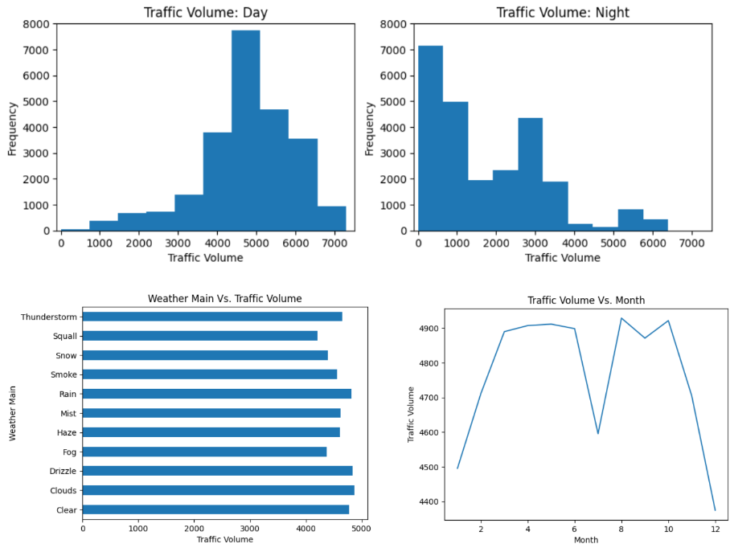

# Analyzing Traffic Indicators
In this project, we will analyze a dataset about the westbound traffic on the [I-94 Interstate highway](https://en.wikipedia.org/wiki/Interstate_94). This dataset was made available by John Hogue and can be downloaded from the [UCI Machine Learning Repository](https://archive.ics.uci.edu/dataset/492/metro+interstate+traffic+volume). Our goal in this project is to determine a few indicators of heavy traffic on I-94. Along the way, we will also use data visualization to help us recognize relationships and correlations.

View this project live on Google Colab [here](https://colab.research.google.com/drive/1FoiO2LyK2Z33O4YceULpcIJvxkKZGtDC?usp=sharing).
